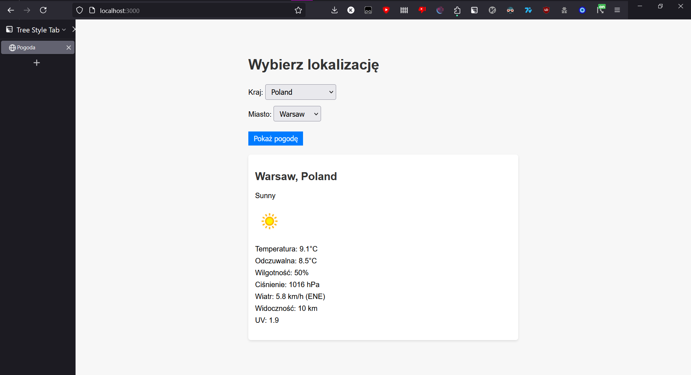
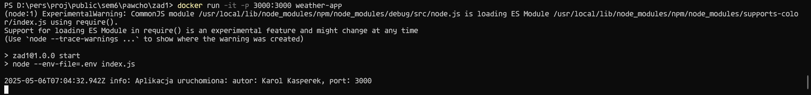

# Zadanie 1

## 1.
Implementacja aplikacji znajduje się w podfolderze `src/`

## 2.
Plik `Dockerfile` dostępny w bieżącym folderze

## 3.

### a) Zbudowanie obrazu kontenera
```
docker build --build-arg WEATHER_API_KEY=<API-KEY> -t weather-app .
```
Klucz należy zdobyć zakładająć konto na [weatherapi.com](https://www.weatherapi.com/).

### b) Uruchomienie kontenera
```
docker run -d -p 3000:3000 weather-app
```

### c) Uzyskanie informacji wygenerowanych przez serwer
```
docker ps
docker exec <CONTAINER-ID> cat /app/logs/combined.log
```

### d) Sprawdzenie ile warstw posiada zbudowany obraz
```
docker history weather-app | tail -n +2 | wc -l
```

## Działanie aplikacji


